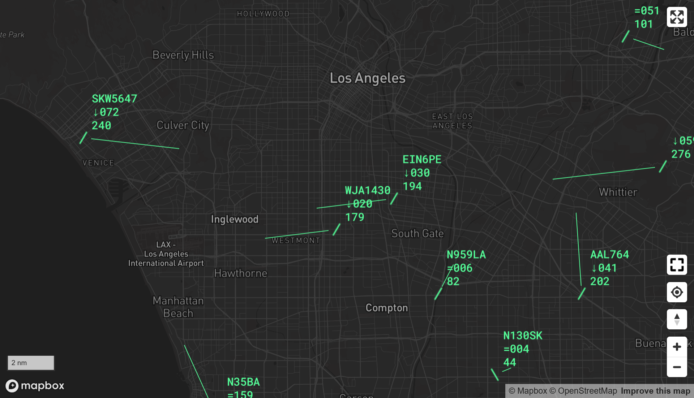

# airplane_thing

A complete software stack for tracking and mapping aircraft via Mode S and ADS-B.



## Requirements

- A Linux system
- A software-defined radio compatible with dump1090
- An antenna suitable for receiving on 1090 MHz

I run airplane_thing on a Raspberry Pi 4 Model B with an RTL-SDR V3 kit that included a dipole.

## Installation

1. Install Docker:
```
curl -sSL https://get.docker.com | sh
sudo usermod -aG docker $USER
```
2. Log out and log back in.
3. Install git:
```
sudo apt install git
```
4. Clone this repo _with submodules_ (--recursive):
```
git clone --recursive https://github.com/electronfraud/airplane_thing.git
cd airplane_thing
```
5. Configure the Mapbox access token:
    1. Sign up for a Mapbox account at https://www.mapbox.com/
    2. Go to https://console.mapbox.com/account/access-tokens/ and copy your token.
    3. Back in your copy of this repo, create a file in `frontend/src` called `token.ts` with the following contents:
```
export const MapboxToken = "paste-your-token-here";
```
6. Build the Docker images:
```
make images
```
7. Start it up (this will start the Docker images in the background and return you to a shell prompt):
```
./start.sh
```
8. In a browser, go to http://your-hostname-here:8080/

## SWIM integration

airplane_thing can use FAA's SWIM service to get flight plan data that is not available over RF: destination airport,
aircraft type, assigned altitude, etc. The setup is a little complicated but worth the effort.

1. Sign up for an account at https://portal.swim.faa.gov/.
2. Create a subscription to Flight FIXM with the following filters:
    1. Message type: Flight Amendment Information; all other fields set to ALL.
    2. Message type: Flight Plan Information; all other fields set to ALL.
    3. Message type: Flight Plan Update Information; all other fields set to ALL.
3. Go to the subscription's Details page and note the following information:
    1. Connection username
    2. Connection password
    3. Queue name
    4. JMS connection URL
    5. Message VPN
4. Create a file in `aggregator` called `.env` with the following contents:
```
SWIM_URL="url here"
SWIM_QUEUE="queue name here"
SWIM_USER="username here"
SWIM_PASSWORD="password here"
SWIM_VPN="vpn name here"
```
4. If airplane_thing is running, restart it:
```
./stop.sh
./start.sh
```

Note that the values for SWIM_USER and SWIM_PASSWORD are the connection username and connection password from your
subscription detail page, _not_ your SWIM login information.

It may take a few minutes for flight plan information to begin appearing on the map. The SWIM integration works more
effectively the longer you leave the system running.

## What is all this nonsense?

The display is loosely based on real Air Traffic Control radar displays. Targets (aircraft) are depicted by symbols
that vary depending on what kinds of information the system has received about them:

"squawk" | "alt-no-squawk" | "no-alt-no-squawk" | "vfr";
- `\`: Target has a transponder code other than 1200, 1201, or 1202. These aircraft are in contact with ATC and are
  receiving radar services.
- `/`: Target has altitude information but no transponder code information.
- `V`: Target is squawking 1200, 1201, or 1202. These aircraft are "squawking VFR," meaning they are operating
  under Visual Flight Rules and are not in contact with an ATC radar facility.
- `+`: Target has neither altitude nor transponder code information.

If a target has velocity information (ground speed and course), there will be a line extending out from the target. The
tip of the line is where the aircraft will be in one minute if it maintains its present ground speed and course.

Additional information, when available, is depicted in a data block next to each target. Here is an example of a
basic data block:

```
AAL404
390
400
```

The first line is the flight number, callsign, or aircraft registration number. In the example, this is AAL404, i.e.
American Airlines flight 404. The second line is altitude in hundreds of feet, so the example aircraft is at 39,000
feet (technically "flight level" 390, or FL390). The third line shows ground speed in knots. The example aircraft is
moving at 400 knots (460 mph, 741 km/h).

If an aircraft is squawking one of the special emergency transponder codes, it will be displayed in red, and a code
will appear on the last line of the data block:

- `ADIZ`: Aircraft is penetrating the Air Defense Identification Zone but is unable to establish contact with ATC.
- `LLNK`: Unmanned aircraft has lost its control link.
- `HIJK`: Unlawful interference.
- `RDOF`: Aircraft's voice radio(s) have malfunctioned and are inoperative.
- `EMRG`: Unspecified emergency.
- `AFIO`: Military aircraft operating without ATC clearance.

With SWIM integration, additional data becomes available.

```
ASA1137
360↑331
88C 462
KSEA
```

Now the altitude line (the second line) includes two additional elements: assigned altitude and vertical tendency. In
this case, the has an assigned altitude of 36,000 feet, is climbing, and is currently at 33,100 feet. The third line
shows the "computer ID" (CID), which is an identifier used internally by ATC computers, and the ground speed in knots.
The fourth line shows the flight's destination airport.

Note that the symbology communicates what kinds of information have been _received_, not necessarily the truth about
the flights themselves. For example, if airplane_thing hasn't received a transponder code for an aircraft, it doesn't
necessarily mean the aircraft isn't squawking a code; it just means airplane_thing hasn't received and decoded a
message containing a transponder code from that aircraft recently. This can happen for any number of reasons, most of
which have to do with receiver performance.

## Developing

`./start.sh` has two command-line options that can be used to make hacking on airplane_thing a little easier:
`--expose-radio` and `--dev`. The way I use these is I run from `main` `HEAD` on my Raspberry Pi that has my SDR; I
start this instance with `./start.sh --expose-radio`. This exposes port 30002 on the `radio` container so that other
instances can use the SDR. Then, on my laptop, I run from my work-in-progress repo by running
`RADIO_HOST=ip-of-raspberry-pi ./start.sh --dev`. This starts airplane_thing with no `radio` container, tells
`aggregator` to connect to my Raspberry Pi to get data from the SDR there instead, and makes it so I don't have to
rebuild the Docker images every time I change any code. The frontend will reload code changes automatically;
`aggregator` must be restarted with `docker restart` to pick up changes (but does not need to be rebuilt).
